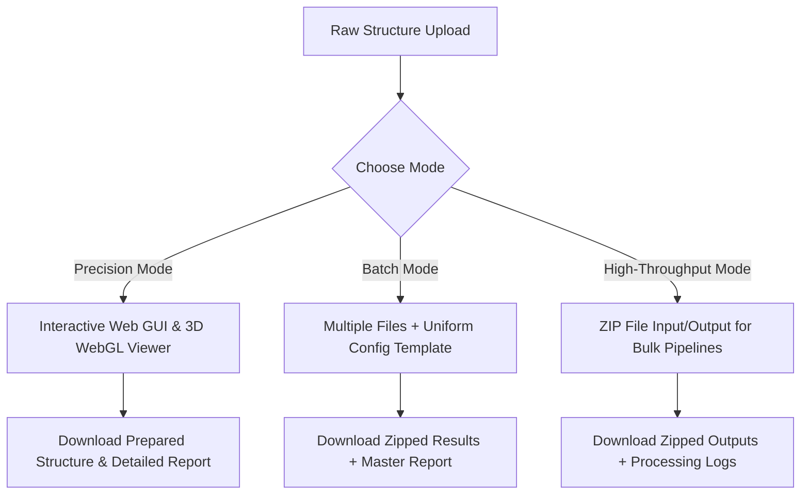

# BioPrep Pro: The Ultimate Automated Protein Preparation Pipeline
### *Technical Pitch, Architectural Specification, and Business Case*

---

## 1. Executive Pitch & Value Proposition

In the fields of **computer-aided drug design (CADD)**, **virtual screening**, and **molecular dynamics (MD)**, the quality of downstream simulations relies entirely on the structural integrity of the input macromolecule. 

Structures retrieved from the Protein Data Bank (PDB) are messy. They contain:
*   Unwanted crystallographic water molecules and buffer agents.
*   Steric clashes and overlapping atoms.
*   Missing residues, broken loops, and incomplete sidechains.
*   Undetermined hydrogen positions and incorrect protonation states.

### The Bottleneck
Historically, preparing these structures is a manual, tedious, and error-prone process. Computational chemists spend hours using outdated desktop GUI tools (like PyMOL, Chimera, or AutoDock Tools) to clean structures before they can even begin their actual work. When scaling up to virtual screenings containing hundreds or thousands of targets, or preparing datasets for machine learning models, manual preparation becomes a complete bottleneck.

### The BioPrep Pro Solution
**BioPrep Pro** is an automated, high-performance macromolecular preparation pipeline. It takes raw PDB files and prepares them into clean, protonated, energy-minimized, and docking-ready models in seconds.

*   **Saves Time:** Automates structural cleanup, loop reconstruction, and protonation into a unified pipeline.
*   **Ensures Reproducibility:** Features JSON-based configuration templates that can be saved, exported, and shared across research teams to enforce standard operating procedures (SOPs).
*   **Prevents Crashes:** Standard bioinformatic toolkits crash when they encounter non-standard residues or complex molecular structures. BioPrep Pro utilizes a robust fallback architecture to guarantee a usable output file under any circumstance.
*   **Scalable:** Accessible through an intuitive Web GUI for individual chemists, and a CLI/API backend for automated bioinformatics workflows.

---

## 2. Platform Processing Modes

BioPrep Pro scales to fit different workflow requirements via three dedicated operating modes:



### I. Precision Mode (Single Target Deep Dives)
*   **Target Audience:** Structural biologists and lead optimization chemists.
*   **Interface:** Visual WebGUI integrated with a WebGL-based 3D viewer (`3Dmol.js`).
*   **Capabilities:** Full control over chain isolation, selection of specific heteroatoms to preserve or delete, targeted pH sliders, loop/atom repair options, and energy minimization parameters.
*   **Visual Diff Mode:** Overlays the raw structure (semi-translucent grey) with the prepared structure (colored by spectrum) so researchers can physically inspect sidechain relaxation and loop insertions in real time.

### II. Batch Mode (Multi-Target Processing)
*   **Target Audience:** Bench chemists working on parallel assays.
*   **Capabilities:** Drag and drop 10–50 PDB files simultaneously.
*   **Execution:** Applies a unified configuration preset or custom parameter set across all targets. Processes them and provides a zipped archive of the prepared structures along with an aggregated master report.

### III. High-Throughput (HT) Mode (Big Data / Machine Learning)
*   **Target Audience:** Data engineers and computational chemists building virtual screening datasets.
*   **Capabilities:** Accepts a single `.zip` containing hundreds of raw structures.
*   **Execution:** Runs an automated pipeline to extract, clean, repair, protonate, minimize, and repackage the structures. Generates detailed run logs documenting atom changes, energy drops, and any warning flags.

---

## 3. Deep-Dive Technical Architecture & Algorithms

BioPrep Pro's backend is a multi-stage Python pipeline integrated with specialized computational biology toolkits.

```
[Raw PDB] ➔ [1. Cleaning Engine] ➔ [2. Protonation/Repair] ➔ [3. OpenMM Energy Minimization] ➔ [4. Pocket & Pharmacophore Analyzer] ➔ [5. Format Exporter]
```

### Stage 1: Structural Cleaning & Curation Engine
*   **Library:** Biopython (`Bio.PDB`)
*   **Chain Selection:** Filters the PDB model to include only the specified `target_chains`. Standard protein residues are filtered at the residue-level based on the chain parent ID, preserving spatial geometry.
*   **Surgical Heteroatom Curation:** Raw PDBs contain crystallographic waters (`HOH`), ions, and small-molecule ligands labeled as `HETATM`. BioPrep Pro separates these:
    *   *Water Removal:* Removes standard bulk water residues.
    *   *Smart Structural Water Preservation:* Bridges between proteins and ligands are often mediated by water molecules. BioPrep Pro builds a spatial **NeighborSearch** (`scipy.spatial.KDTree` wrapper) containing only standard protein atoms. It then queries the oxygen atom coordinates (`O`, `OW`, `O1`) of each water molecule. If a water molecule is within **4.0 Å** of any protein atom, it is classified as a "structural water" and preserved; otherwise, it is stripped.
    *   *Ligand Curation:* User-selected ligands are protected from deletion based on residue name matching (`residue.resname.strip()`), while other crystallization agents and buffers are deleted.

### Stage 2: Protonation & Rebuilding (Splitting Architecture)
*   **Library:** PDBFixer (`pdbfixer`) & OpenMM
*   **The Problem:** PDBFixer uses standard topologies to determine atom connectivity and add missing atoms or hydrogens. When it encounters a novel small-molecule ligand or co-factor, it lacks a topological template and will either corrupt the ligand's geometry or fail.
*   **The Split-and-Merge Algorithm:**
    1.  **Isolation:** BioPrep Pro parses the cleaned PDB file line-by-line and splits it into standard protein records (`ATOM`, `TER`, headers) and non-standard records (`HETATM`).
    2.  **Repair & Protonation:** PDBFixer is run **only** on the isolated protein component:
        *   `findMissingResidues()` and `findMissingAtoms()` locate missing heavy atoms and gaps in loops.
        *   `addMissingAtoms()` rebuilds missing sidechain atoms and inserts missing residues/loops.
        *   `addMissingHydrogens(ph)` adds hydrogen atoms and assigns protonation states (e.g., Histidine tautomers, Aspartate/Glutamate states) based on the user-selected physiological pH.
        *   The repaired protein coordinates are saved using `openmm.app.PDBFile.writeFile`.
    3.  **Merge:** The untouched, pristine `HETATM` records are merged back with the protonated protein. This keeps the coordinate precision and connectivity of the experimental ligand intact.

### Stage 3: Three-Tier Physical Energy Minimization
*   **Library:** OpenMM
*   **Physics Settings:** Uses Langevin Middle Integration (`LangevinMiddleIntegrator`) at 300K, friction coefficient of 1/ps, and a 0.002 ps timestep. Hydrogen bonds are constrained (`constraints=app.HBonds`) to prevent high-frequency oscillations. The implicit solvent is modeled using the Generalized Born Surface Area (GBSA) model (**OBC2**).
*   **Robust Fallback Architecture:**
    To prevent server crashes on complex biological targets, the minimization engine attempts three tiers of execution:

```
                  ┌───────────────────────────────┐
                  │   Raw Cleaned/Protonated PDB  │
                  └───────────────┬───────────────┘
                                  │
                                  ▼
      [TIER 1] ───►  Full Structure Minimization
      (AMBER14/      (Protein + DNA + Ligand + Water)
      CHARMM36)                   │
                                  ├─► Success ──► Save PDB
                                  │
                                  ▼ Fail (e.g., unknown ligand parameters)
      [TIER 2] ───►  Safe-Residue Extraction
      (Residue       * Strip unknown residues (ligands, non-standards)
      Filtering &    * Minimize protein/DNA/water backbone
      Merger)        * Merge coordinates back using 4-tuple keys:
                       (chain_id, res_name, res_id, atom_name)
                                  │
                                  ├─► Success ──► Save PDB (Untouched Ligand)
                                  │
                                  ▼ Fail (e.g., GBSA charge distribution error)
      [TIER 3] ───►  Vacuum Safe Minimization
      (Vacuum        * Retry Tier 2 without GBSA implicit solvent model
      Fallback)                   │
                                  ├─► Success ──► Save PDB (Untouched Ligand)
                                  │
                                  ▼ Fail
      [FALLBACK] ──► Copy Original Structure & Log Diagnostics (No Crash)
```

*   **Name-Based Coordinate Merger:** During Tier 2/3, atoms are added or modified during loop repair. A direct coordinate copy would fail due to atom index mismatches. BioPrep Pro maps coordinates using a unique 4-tuple key: `(chain_id, residue_name, residue_id, atom_name)`. Only the coordinates of standard biopolymer atoms are updated, leaving the ligand coordinates unchanged.

### Stage 4: Binding Site Analyzer (Pocket Detection)
*   **Libraries:** SciPy (`scipy.spatial.KDTree`), Scikit-Learn (`sklearn.cluster.DBSCAN`), NumPy
*   **Algorithm Steps:**
    1.  **Dynamic Grid Scaling:** A 3D grid is constructed around the protein's bounding box. To prevent memory issues on large complexes, if the grid size exceeds 250,000 points, the resolution is scaled:
        $$\text{Resolution} = \max\left(1.5, \sqrt[3]{\frac{\text{Box Volume}}{250,000}}\right)$$
    2.  **Spatial Pre-filtering:** A KD-Tree of protein atoms is queried. Grid points are kept if their distance to the closest protein atom ($D_{\min}$) satisfies:
        $$2.8 \text{ Å} \text{ (probe radius)} < D_{\min} < 7.5 \text{ Å}$$
    3.  **LIGSITE-Style Enclosure Ray-Casting:** For each grid point, 6 directional rays are cast along the Cartesian axes (X±, Y±, Z±). A ray is blocked if a protein atom is located within a cylinder of length 12.0 Å and radius 2.5 Å ($D_{\text{perp}}^2 < 6.25 \text{ Å}^2$). If a grid point is blocked in **3 or more directions**, it is classified as an enclosed pocket point.
    4.  **DBSCAN Clustering:** The enclosed pocket points are clustered using DBSCAN (`eps = grid_res * 1.5`, `min_samples = 10`) to isolate distinct pocket volumes.
    5.  **Multi-Factor Drugability Scoring ($S_{\text{drug}}$):**
        Each detected pocket is scored from 0.00 to 0.99 using a weighted equation:
        $$S_{\text{drug}} = 0.30 \cdot W_{\text{volume}} + 0.20 \cdot W_{\text{diversity}} + 0.20 \cdot W_{\text{balance}} + 0.20 \cdot W_{\text{concavity}} + 0.10 \cdot W_{\text{pharm}}$$
        *   **$W_{\text{volume}}$:** Penalty-based volume score. Volumes between 300–1000 ų score 1.0 (ideal for drug-like small molecules). Too small ($<100$ ų) or too large ($>1000$ ų) receive lower scores.
        *   **$W_{\text{diversity}}$:** Score (0.0 to 1.0) based on the presence of hydrophobic, polar, and charged residues lining the pocket.
        *   **$W_{\text{balance}}$:** Measures how close the hydrophobic residue ratio is to the biological ideal of 40%:
            $$W_{\text{balance}} = \max\left(0.0, 1.0 - | \text{hydrophobic ratio} - 0.4 | \cdot 2\right)$$
        *   **$W_{\text{concavity}}$:** Geometric concavity calculated from the spatial spread of pocket points:
            $$W_{\text{concavity}} = 1.0 - \frac{\sigma(D_{\text{centroid}})}{\mu(D_{\text{centroid}})}$$
        *   **$W_{\text{pharm}}$:** Predicts H-bond donors, acceptors, aliphatic centers, and aromatic centroids (calculated as the average of the ring atoms).

### Stage 5: Docking-Ready Exporter
*   **Library:** OpenBabel (`obabel`) integration via secure subprocess execution.
*   **PDBQT Export:** Automatically converts the prepared PDB to `.pdbqt` format for docking in AutoDock Vina.
    *   Calculates **Gasteiger partial charges** (`--partialcharge gasteiger`) for electrostatic modeling.
    *   Merges non-polar hydrogens onto heavy atoms (`-xh`) to comply with the united-atom model.
*   **GROMACS Export:** Formats and names structures (`_gromacs.pdb`) to be compatible with GROMACS topology generation (`gmx pdb2gmx`).

---

## 4. Software & GUI Technology Stack

### Backend Stack
*   **Web Framework:** Flask (Python) with a RESTful API.
*   **Task Handling:** Native multi-threading for batch operations.
*   **Data Storage:** Lightweight, file-based JSON storage for saved preset templates (`templates_store.json`) and job history metadata (`jobs_history.json`). Prepared structures are saved in a local, persistent results directory.

### Frontend Stack
*   **Layout:** Responsive HTML5 and Vanilla CSS3 styled with a modern glassmorphic look.
*   **State Management:** Vanilla JavaScript.
*   **3D WebGL Visualization:** `3Dmol.js` is used to render structures.
    *   *United-Atom Rendering:* Custom styles for PDBQT files that map bonds and atoms without standard connectivity records.
    *   *Ligand Focus:* Custom filters automatically highlight small-molecule ligands and co-factors as thick sticks with Jmol element coloring, while rendering metal ions (e.g., Zn²⁺, Ca²⁺) as spheres.
    *   *Pharmacophore Display:* Renders pockets as semi-translucent cyan spheres and displays predicted pharmacophore features (red for acceptors, blue for donors, yellow for hydrophobics) as interactive, hoverable spheres.
*   **Client-Side Unzipping:** Uses `JSZip` to extract and preview PDB files from processed ZIP files in the browser without needing to download and extract them locally first.
*   **High-Performance Decoding:** Base64-encoded file strings from API responses are converted to text using a performance-optimized Uint8Array decoder, preventing the browser main thread from freezing when loading large structures.

---

## 5. Summary of Technical Features

| Feature | Technical Implementation | Value to Researcher |
| :--- | :--- | :--- |
| **pH-Dependent Protonation** | PDBFixer protonation assignments at user-specified pH | Models accurate charge states for physiological docking |
| **Missing Loop & Atom Repair** | Heavy atom insertion and loop rebuilding using PDBFixer | Fixes broken structures so docking programs don't fail |
| **Energy Minimization** | OpenMM Langevin integrator with AMBER14/CHARMM36 | Relaxes structures and resolves steric clashes |
| **Ligand Preservation** | Split-and-merge architecture protecting `HETATM` records | Keeps co-crystallized ligand geometry intact during prep |
| **Smart Water Filtering** | KD-Tree search preserving waters within 4.0 Å of protein | Keeps structural bridging waters that influence binding |
| **Pocket Detection** | Dynamic grid LIGSITE ray-casting and DBSCAN clustering | Identifies binding cavities and calculates drugability scores |
| **WebGL Visual Diff** | Translucent raw model overlay with prepared model | Visualizes structural changes and sidechain relaxation |
| **PDBQT Exporter** | OpenBabel Gasteiger charge assignment & H-merging | Generates docking-ready structures |
| **Reproducibility Templates** | JSON template importing and exporting | Standardizes prep settings across teams |
